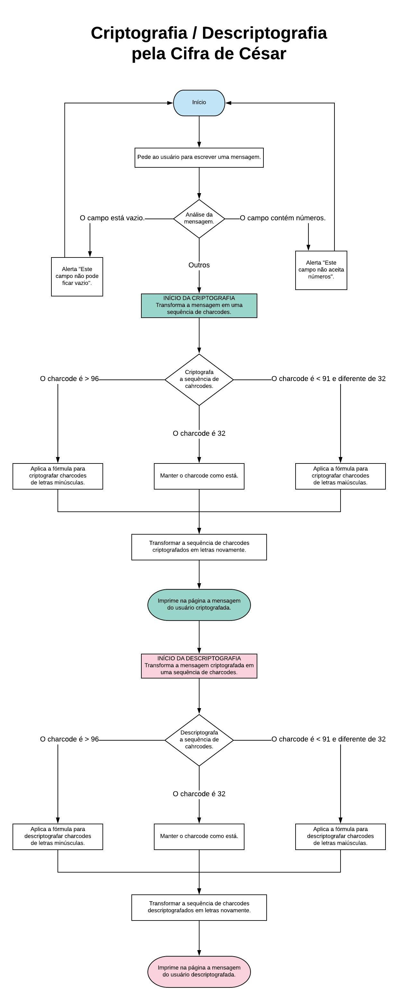

# Criptografia e Descriptografia com Cifra de César

O site criptografa / descriptografa mensagens de texto segundo a Cifra de César. Após o usuário inserir a mensagem no campo apropriado, poderá escolher a tarefa que deseja realizar (criptografar ou descriptografar). A partir da escolha, é exibido na página o resultado do procedimento. 

Trabalho realizado em junho de 2018 como produto final do Sprint 1 da Laboratória e refatorado em setembro de 2018. 

## Requisitos 

Os requisitos deste desafio eram:

- Parâmetro de deslocamento das palavras de 33 espaços à direita;
- Capacidade de criptografar e descriptografar letras maiúsculas e minúsculas;
- Usar apenas duas funções para executar as tarefas: cypher e decypher;
- Não permitir que o usuário insira um campo vazio ou que contenha números;
- Explicar o raciocínio por trás do código por meio de um fluxograma e um pseudocódigo.

Em setembro de 2018 refatorei o código, realizando as seguintes modificações:

- Troca do prompt para inserção da mensagem por uma `textarea` na página principal;
- Separação das tarefas: agora o usuário pode escolher, por meio de botões, se deseja criptografar ou descriptografar a mensagem;
- Se a textarea se mantiver vazia, os botões `Criptografar` e `Descriptografar` se manterão desabilitados, impedindo seu acionamento;
- Capacidade de criptografar / descriptografar letras com acento.
- Capacidade de criptografar / descriptografar números.
- Capacidade de reconhecer espaços, quebras de linhas e pontuação. Mantendo-os na versão criptografada / descriptografada.
- Atualização do arquivo README.md.

## Conhecimentos empregados

A versão atual da página foi desenvolvida utilizando:

- ECMAScript 6;
- Eslint;
- HTML5 e CSS3;
- Flexbox.

## Pseudocódigo

>Após o usuário inserir uma mensagem no campo apropriado, selecionará a função desejada. Se selecionar a opção "Criptografar", a função cypher será executada:

    INÍCIO DA FUNÇÃO cipher = () => {
      DEFINIR uma constante chamada cypheredCharCodes que armazena o resultado da função cypherCharcodes(getCharcodesFromMessage());

      INÍCIO DA FUNÇÃO cypherCharcodes = () => {
        EXECUTAR a função getCharcodesFromMessage;

          INÍCIO DA FUNÇÃO getCharcodesFromMessage = () => {
            EXECUTAR a função getMessage;

              INÍCIO DA FUNÇÃO getMessage = () => 
              RETORNAR o valor da textarea, ou seja, a mensagem inserida pelo usuário;
              FIM DA FUNÇÃO getMessage
            
            SEPARAR as letras da mensagem obtida em uma array e
            EXECUTAR um MAP na array {
              TROCAR cada letra da array pelo seu charCode;
            }
            RETORNA uma array de charCodes;
          }
          FIM DA FUNÇÃO getCharcodesFromMessage

>Portanto, a constante cypheredCharCodes será uma array de charCodes, obtidos ao separar as letras da mensagem inserida pelo usuário em uma array e transformando cada letra em seu número charCode.

        EXECUTAR um MAP na array de charCodes {
          SE (o charCode for um número) {
            DESLOCAR o número 33 casas para frente, sendo 10 opções de casas (números de 0-9);
          } MAS SE (o charCode for uma letra maiúscula) {
            DESLOCAR a letra 33 casas para frente, sendo 26 opções de casas (letras de A-Z);
          } MAS SE (o charCode for uma letra minúscula) {
            DESLOCAR a letra 33 casas para frente, sendo 26 opções de casas (letras de a-z);
          } MAS SE (o charCode for uma letra maiúscula com acento) {
            DESLOCAR a letra 33 casas para frente, sendo 30 opções de casas (letras com acento de À-Ý);
          } MAS SE (o charCode for uma letra minúscula com acento) {
            DESLOCAR a letra 33 casas para frente, sendo 34 opções de casas (letras com acento de Þ-ÿ);
          }
        RETORNA o charCode; 
      }
      FIM DA FUNÇÃO cypherCharcodes

>Dessa forma, cada charCode da array cypheredCharCodes será classificado em um grupo (charCodes de número, letra maiúscula, minúscula ou com acentos). Depois, o charCode será criptografado, ou seja, será trocado pelo número de charCode de seu respectivo grupo que estiver 33 posições à sua frente. 

      DEFINIR uma constante chamada resultMessage que contém o resultado da função transformIntoLetters(cypheredCharCodes);

        INÍCIO DA FUNÇÃO transformIntoLetters = (cypheredCharCodes) => RETORNAR a transformação de cada charCode em letra;
        FIM DA FUNÇÃO transformIntoLetters

>Assim, transformIntoLetters irá transformar a array de charCodes criptografados novamente em uma string de letras, que será armazenada na constante resultMessage.

      DEFINIR uma constante chamada method que armazena a tarefa escolhida pelo usuário. Nesse caso, é "criptografada";

      EXECUTAR a função showResultsOnPage(resultMessage, method);

        INÍCIO DA FUNÇÃO showResultOnPage = (resultMessage, method) => {
          RETORNAR no HTML a seguinte mensagem: "Esta é a sua mensagem ${method}: 
            ${resultMessage}"
        }
        FIM DA FUNÇÃO showResultOnPage

>Por fim, a mensagem criptografada será inserida no HTMl por meio da função showResultsOnPage. A constante method será usada para preencher a seguinte frase "Está é a sua mensagem ${method}", sendo method, nesse caso, a palavra "criptografada". Caso o usuário tivesse escolhido a opção Descriptografar, a palavra inserida no local seria "descriptografada". 
      
      EXECUTAR a função clearTextArea();

        INÍCIO DA FUNÇÃO clearTextArea = () => {
          LIMPAR a textarea;
          EXECUTAR a função enableButtons(); 

            INÍCIO DA FUNÇÃO enableButtons = () => {
              SE (o campo textarea estiver vazio) {
                DESABILITAR os botões 'Criptografar' e 'Descriptografar';
              } SENÃO {
                HABILITAR os botões 'Criptografar' e 'Descriptografar';
              }
            }
            FIM DA FUNÇÃO enableButtons
          
          EXECUTAR a função addTextAreaRows();

            INÍCIO DA FUNÇÃO addTextAreaRows = () => {
              AUMENTAR o tamanho da texarea conforme a altura do scrollbar da mesma;
            }
            FIM DA FUNÇÃO addTextAreaRows
        }
        FIM DA FUNÇÃO clearTextArea
    }
    FIM DA FUNÇÃO cipher

>A última tarefa da função cypher é limpar a textarea para receber uma nova mensagem pelo usuário. Ao fazer isso, a textarea ficará vazia, portanto, os botões Criptografar e Descriptografar ficarão desabilitados. O tamanho da textarea, caso tenha sido expandido pelo tamanho da mensagem recém criptografada, também precisará retornar ao tamanho normal, por isso executa-se a função addTextAreaRows. 

>Portanto, a função cipher(message):
>1) Transforma a mensagem digitada pelo usuário em uma array composta pelo charcode de cada letra da mensagem;
>2) Criptografa os charcodes da array;
>3) Transforma os charcodes criptografados novamente em letras e os junta em uma string.
>4) Imprime na página a mensagem do usuário criptografada.
>5) Reseta o campo de inserção de mensagem para receber uma nova mensagem pelo usuário.

>A função decypher funcionará da mesma forma, a única diferença estará na função decypherCharcodes, que ao invés de buscar o charCode 33 posições à frente do charCode original, fará o movimento contrário. Isto é, dado um determinado charCode, buscará o charCode que estiver 33 posições atrás dele, encontrando a letra original, antes de mensagem ser criptografada.

## Fluxograma

O seguinte fluxograma diz respeito à primeira versão da página, desenvolvida antes da refatoração. Nessa versão, o usuário não podia escolher entre criptografar / descriptografar, as duas tarefas eram sempre executadas em sequência. Além disso, ainda não era possível inserir números no campo da mensagem. 

